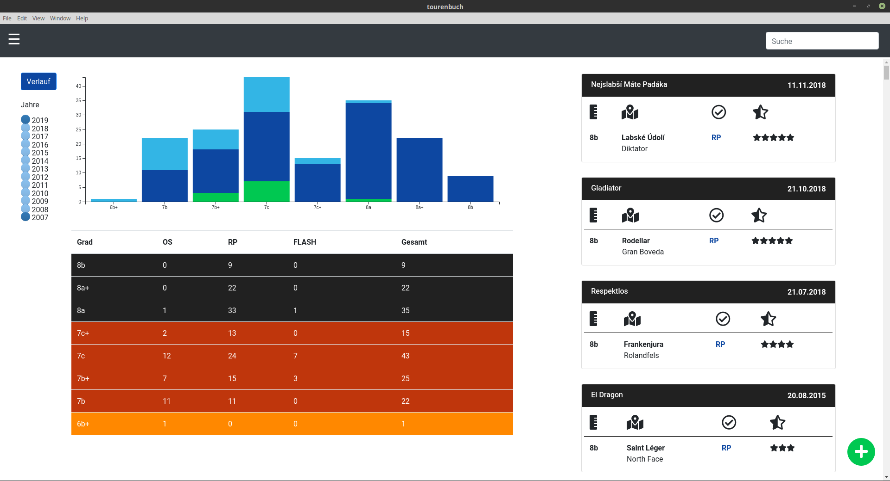
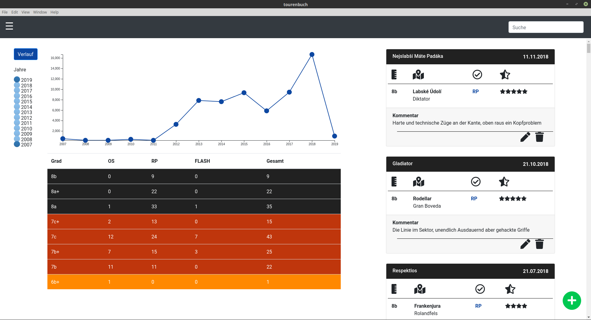
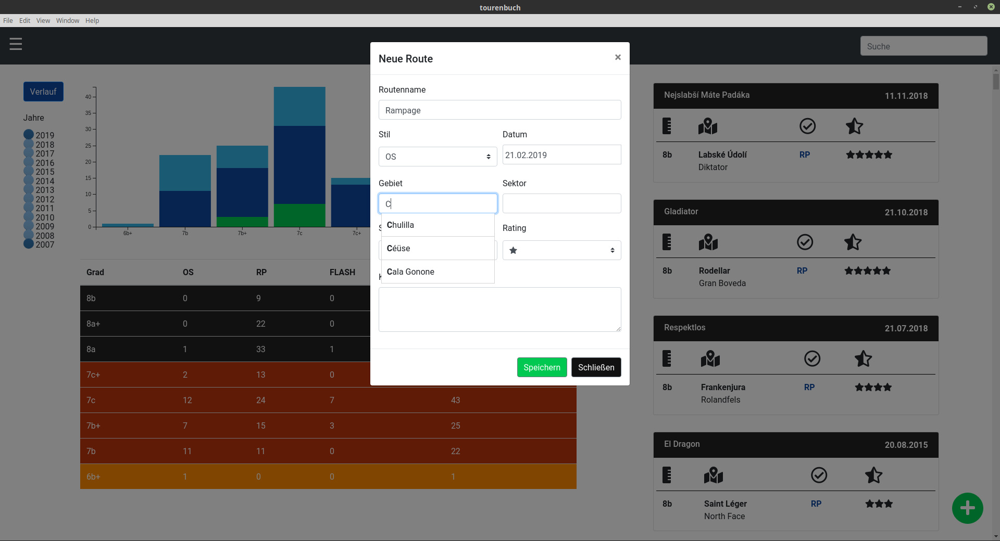

Electron App, welche als Virtuelles Routentagebuch dient. 
Die App befindet sich noch im **Beta** Status und soll Persepktivisch noch durch einen Training- und Bouldermodus ersetzt werden.
#### Funktionen
- Diagramme (Verlauf- und Balkendiagramm)
- Hinzufügen, verändern, löschen von Einträgen
- Suche nach Gebieten, Routen, Graden...

#### Quickstart
```shell
    git clone https://github.com/LorenMucha/Climbing-Diary
    cd Climbing-Diary
    npm install
    npm start
```
#### Screenshot


